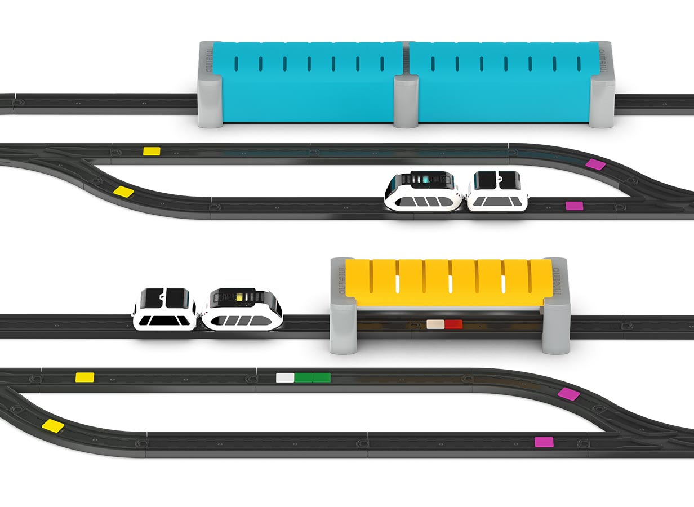

intelino-trainlib-py API Reference Guide
=========================================
Welcome to the API Reference Guide for **intelino-trainlib-py** - the **synchronous Python library** for the intelino smart train.

.. image:: https://readthedocs.org/projects/intelino-trainlib-py/badge/?version=latest
   :target: https://intelino-trainlib-py.readthedocs.io/en/latest/?badge=latest
   :alt: Documentation Status

.. image:: https://img.shields.io/pypi/v/intelino-trainlib.svg
   :target: https://pypi.python.org/pypi/intelino-trainlib

.. image:: https://img.shields.io/pypi/pyversions/intelino-trainlib.svg
   :target: https://pypi.python.org/pypi/intelino-trainlib

.. toctree::
   :hidden:
   :maxdepth: 0
   :caption: QUICK START
   :numbered:

   installation.rst
   scanning.rst
   usage.rst

.. toctree::
   :hidden:
   :maxdepth: 3
   :caption: API REFERENCE GUIDE
   :includehidden:

   api/overview.rst
   api/index.rst

.. toctree::
   :hidden:
   :maxdepth: 3
   :caption: OTHER
   :includehidden:

   bugs.rst
   license.rst

Overview
=========

Intelino Smart Train is an award-winning programmable robotic toy that is both fun and educational. Powered by innovative robotic tech, the smart train offers multiple programming modes suitable for users of different ages.

Learning is more meaningful and relatable when experimenting with and simulating real world problems. Younger kids use screen-free activities and tactile coding to operate the smart trains and make them run on schedule. And older users, students and makers use our advanced tools to build smart rail systems and experiment with autonomous driving, collision avoidance, route optimization, resource sharing and much more!

We offer both synchronous and asynchronous Python programming libraries for the intelino smart train. The **intelino-trainlib**, described in this document, is our synchronous Python library. It gives access to our full-featured API, enables event-based programming and allows to interactively control one or multiple smart trains. This library is well suited for students and users that are new to Python or text-based programming, in general. And programmers with more advanced skills may prefer our asynchronous library **intelino-trainlib-async** which offers an extended list of API features, Rx-based reactive programming and superior performance.

Indices and tables
==================

* :ref:`genindex`
* :ref:`modindex`
* :ref:`search`
